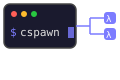

<p align="center"></p>

# cspawn

Spawn profiled Claude Code agents in isolated git worktrees via [cmux](https://github.com/gastownhall/cmux).

Each invocation:
1. Reads an agent profile from `.agents/profiles/<name>.md`
2. Creates a fresh git worktree on a new branch forked from `main`
3. Writes scoped `settings.local.json` permissions into the worktree
4. Opens a new terminal tab in the current cmux workspace, starts `claude` inside the worktree
5. Waits for the Claude banner, then sends a kickoff message

## Install

```sh
uv tool install git+https://github.com/heinrichhartmann/cspawn
```

## Usage

```sh
cspawn profiles                                        # list available profiles
cspawn "implement the bead" --profile worker --beads "gax-sy6"
cspawn "research X" --profile researcher --no-fork     # no worktree
cspawn "quick fix" --profile developer --here          # use current tab
```

### Options

| Flag | Default | Description |
|------|---------|-------------|
| `prompt` | required | First message sent to the agent |
| `--profile` | | Profile name in `.agents/profiles/` (walks up to `$HOME`) or a file path |
| `--model` | | Claude model override (default: global `settings.json`) |
| `--beads` | | Bead IDs or label to scope the agent to |
| `--extra-prompt` | | Text appended to the system prompt |
| `--no-fork` | | Run in the current repo without creating a git worktree |
| `--here` | | Launch in the current cmux tab instead of opening a new one |
| `--timeout` | `30` | Seconds to wait for Claude banner |
| `--workspace` | auto | cmux workspace ref (default: `cmux current-workspace`) |

### Profile frontmatter

Profiles (`.agents/profiles/<name>.md`) may start with a YAML block:

```yaml
---
description: one-line summary
when: when to invoke this profile
capabilities: what the agent can do
permissions: Edit, Write, Bash(git:*), Bash(bd:*)
updated: YYYY-MM-DD
---
```

The `permissions` field is written verbatim into the worktree's `.claude/settings.local.json` allow list.

## Requirements

- [`cmux`](https://github.com/gastownhall/cmux) in `PATH`
- `direnv` (optional — used if `.envrc` exists in the repo)
- `git` with worktree support
- `claude` CLI ([Claude Code](https://claude.ai/code))
